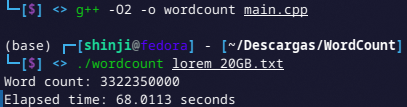
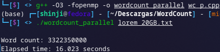

# WordCount

By Braulio Nayap Maldonado Casilla

## Execution

```bash
python generate.py
```

## Output


## Execution

```bash
g++ -O2 -o wordcount main.cpp
./wordcount lorem_20GB.txt
```

## Output



## Execution

```bash
g++ -O3 -fopenmp -o wordcount_parallel wc_p.cpp
./wordcount_parallel lorem_20GB.txt
```

## Output



## Author

- **ShinjiMC** - [GitHub Profile](https://github.com/ShinjiMC)

## License

This project is licensed under the MIT License. See the [LICENSE](LICENSE) file for details.
