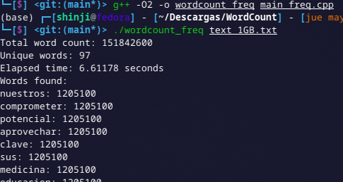

# Word Count [ES]

By Braulio Nayap Maldonado Casilla

## Introducción

El **Word Count**, también llamado **Conteo de Palabras**, es una operación fundamental en análisis de texto y procesamiento de lenguaje natural (NLP), que consiste en:

- **Contar el número total de palabras** en un texto.
- **Calcular la frecuencia de cada palabra** (palabras únicas y cuántas veces aparecen).

Es útil para tareas como:

- Análisis de frecuencia de palabras en libros o corpus.
- Extracción de palabras clave.
- Preprocesamiento de datos para modelos de lenguaje.
- Compresión, indexación o limpieza de textos.

## Implementación

### 1. Generación de Archivos de Texto de Gran Tamaño (N GB)

Este script en Python genera archivos de texto con contenido repetido hasta alcanzar el tamaño especificado (en GB). El texto simula párrafos reales para pruebas de conteo de palabras.

#### Ejecución

```bash
python generate.py <n_gb>
```

#### Salida


### 2. Conteo de Palabras (Word Count) Secuencial

1. **Definición de separadores:**

   En la función `is_separator` se identifica si un carácter es espacio o puntuación. Esto permite detectar cuándo termina una palabra.

   ```cpp
   bool is_separator(unsigned char c)
   {
       return std::isspace(c) || std::ispunct(static_cast<unsigned char>(c));
   }
   ```

2. **Conteo de palabras:**

   La función `count_word_frequencies` recibe como parametro el archivo y lo recorre por bloques de 1MB y construye palabras carácter por carácter, convirtiendo todo a minúsculas. Cuando encuentra un separador, almacena la palabra en un `unordered_map` y lleva el conteo total de palabras.

   ```cpp
   constexpr size_t BUF_SIZE = 1 << 20; // 1MB
   std::vector<char> buffer(BUF_SIZE);
   std::unordered_map<std::string, size_t> word_freq;
   std::string word;
   total_words = 0;
   ```

3. **Lectura en bloques y procesamiento:**

   Se lee el archivo abierto `is` en bloques de tamaño fijo (`BUF_SIZE`) que se almacenarán en `buffer` para eficiencia y se analiza carácter por carácter. Si es alfanumérico, se agrega a la palabra actual, y si es un separador, se guarda la palabra y se reinicia la cadena.

   ```cpp
    is.read(buffer.data(), buffer.size());
    std::streamsize bytesRead = is.gcount();
    for (std::streamsize i = 0; i < bytesRead; ++i)
    {
        unsigned char c = static_cast<unsigned char>(buffer[i]);
        if (std::isalpha(c) || std::isdigit(c)) word += std::tolower(c);
        else if (!word.empty() && is_separator(c))
        {
            ++word_freq[word];
            ++total_words;
            word.clear();
        }
    }
   ```

4. **Finalización del conteo y retorno:**

   Si hay una palabra pendiente tras finalizar la lectura del archivo, también se agrega. Finalmente, se devuelve el mapa de frecuencias.

   ```cpp
   if (!word.empty()) {
       ++word_freq[word];
       ++total_words;
   }
   return word_freq;
   ```

5. **Función principal (`main`):**
   En la principal función se recibe el nombre del archivo como parámetro, y se abre en binario. Se desactiva la sincronización con `stdio` y `cin` para optimizar velocidad. Y para ejecutar la función principal `count_word_frequencies` se inicia el contador con `std::chrono` y al final se muestran los datos de total de palabras, palabras únicas y su frecuencia.

   ```cpp
   std::ifstream f(argv[1], std::ios::in | std::ios::binary);
   auto start = std::chrono::high_resolution_clock::now();
   auto freq = count_word_frequencies(f, total_words);
   auto end = std::chrono::high_resolution_clock::now();
   ```

#### Código Completo

```cpp
#include <iostream>
#include <fstream>
#include <cctype>
#include <unordered_map>
#include <string>
#include <vector>
#include <chrono>

bool is_separator(unsigned char c)
{
    return std::isspace(c) || std::ispunct(static_cast<unsigned char>(c));
}

std::unordered_map<std::string, size_t> count_word_frequencies(std::istream &is, size_t &total_words)
{
    constexpr size_t BUF_SIZE = 1 << 20; // 1MB
    std::vector<char> buffer(BUF_SIZE);
    std::unordered_map<std::string, size_t> word_freq;
    std::string word;
    total_words = 0;

    while (is)
    {
        is.read(buffer.data(), buffer.size());
        std::streamsize bytesRead = is.gcount();
        for (std::streamsize i = 0; i < bytesRead; ++i)
        {
            unsigned char c = static_cast<unsigned char>(buffer[i]);
            if (std::isalpha(c) || std::isdigit(c))
                word += std::tolower(c);
            else if (!word.empty() && is_separator(c))
            {
                ++word_freq[word];
                ++total_words;
                word.clear();
            }
        }
    }
    if (!word.empty())
    {
        ++word_freq[word];
        ++total_words;
    }

    return word_freq;
}

int main(int argc, char **argv)
{
    if (argc != 2)
    {
        std::cerr << "Usage: " << argv[0] << " file.txt\n";
        return 1;
    }
    std::ifstream f(argv[1], std::ios::in | std::ios::binary);
    if (!f)
    {
        std::cerr << "Cannot open file.\n";
        return 1;
    }
    std::ios::sync_with_stdio(false);
    std::cin.tie(nullptr);

    auto start = std::chrono::high_resolution_clock::now();
    size_t total_words = 0;
    auto freq = count_word_frequencies(f, total_words);
    auto end = std::chrono::high_resolution_clock::now();
    std::chrono::duration<double> elapsed = end - start;

    std::cout << "Total word count: " << total_words << '\n';
    std::cout << "Unique words: " << freq.size() << '\n';
    std::cout << "Elapsed time: " << elapsed.count() << " seconds\n";
    std::cout << "Words found:\n";
    for (const auto &pair : freq)
        std::cout << pair.first << ": " << pair.second << '\n';
    return 0;
}
```

#### Ejecución

```bash
g++ -O2 -o wordcount word_count.cpp
./wordcount text_20GB.txt
```

#### Salida




### 3. Conteo de Palabras con Paralelismo (OpenMP)

1. **Tamaño de bloque (`BLOCK_SIZE`):**

   Se define `BLOCK_SIZE` con un tamaño de 4MB, para dividir el archivo en bloques grandes y eficientes al procesar.

   ```cpp
   constexpr size_t BLOCK_SIZE = 1 << 22;
   ```

2. **Función `process_chunk`:**

   Esta función se encarga de analizar una porción del archivo delimitada por `start` y `end`. Se calcula el tamaño del bloque (`chunk_size`) y se reserva un buffer para leerlo. Se posiciona la lectura al inicio del bloque y se lee `chunk_size` bytes en el bufferm y para evitar errores con `gcount()` obtiene la cantidad real de bytes leídos.

   ```cpp
   void process_chunk(std::ifstream &file, size_t start, size_t end,
                      std::unordered_map<std::string, size_t> &local_map, size_t &local_count)
   {
       size_t chunk_size = end - start;
       std::vector<char> buffer(chunk_size);

       file.seekg(start);
       file.read(buffer.data(), chunk_size);
       size_t bytes_read = file.gcount();
   ```

   Se recorre el buffer y se construyen palabras uniendo caracteres alfanuméricos (convertidos a minúscula) y cuando se encuentra un separador se guarda la palabra en `unordered_map` local y se incrementa el contador local. Al final si queda aún una palabra se guarda.

   ```cpp
       std::string word;
       for (size_t i = 0; i < bytes_read; ++i)
       {
           char c = buffer[i];
           if (std::isalnum(static_cast<unsigned char>(c)))
               word += std::tolower(c);
           else if (!word.empty())
           {
               ++local_map[word];
               ++local_count;
               word.clear();
           }
       }

       if (!word.empty())
       {
           ++local_map[word];
           ++local_count;
       }
   }
   ```

3. **Determinación del tamaño del archivo y preparación de estructuras por bloque:**

   Se abre el archivo en modo binario y se obtiene el tamaño con `tellg()`, y se calcula cuantos bloques de 4MB se necesitan para leer todo el archivo. Se inicializan dos vectores, uno de mapas locales y otro de contador de palabras todo por cada bloque.

   ```cpp
   std::ifstream test_file(filename, std::ios::binary | std::ios::ate);
   size_t file_size = test_file.tellg();
   size_t num_blocks = (file_size + BLOCK_SIZE - 1) / BLOCK_SIZE;

   std::vector<std::unordered_map<std::string, size_t>> thread_maps(num_blocks);
   std::vector<size_t> word_counts(num_blocks, 0);
   ```

4. **Ejecución paralela con OpenMP:**

   Se inicializa el bucle `#pragma omp parallel for` y reparte los bloques entre varios hilos dinámicamente con `schedule(dynamic)`.
   Cada hilo abre una copia del archivo y se calcula el inicio y fin del bloque. Y aca se hacen dos casos:

   - Si el bloque no es el primero, se avanza el inicio del bloque(`start`) hasta encontrar un carácter de separación, para evitar cortar una palabra que comenzó en el bloque anterior.
   - Si el bloque no es el último: se avanza el final mientras se lean caracteres alfanuméricos, hasta encontrar un separador.
     Luego se ejecuta a `process_chunk` con los nuevos límites seguros.

   ```cpp
   #pragma omp parallel for schedule(dynamic)
   for (size_t i = 0; i < num_blocks; ++i)
   {
       size_t start = i * BLOCK_SIZE;
       size_t end = std::min(start + BLOCK_SIZE, file_size);

       std::ifstream file(filename, std::ios::binary);
       if (!file) continue;
       if (i != 0)
       {
           file.seekg(start);
           char c;
           while (start < end && file.get(c) && std::isalnum(static_cast<unsigned char>(c)))
               ++start;
       }
       if (end < file_size && i != num_blocks - 1)
       {
           file.seekg(end);
           char c;
           while (end < file_size && file.get(c) && std::isalnum(static_cast<unsigned char>(c)))
               ++end;
       }
       process_chunk(file, start, end, thread_maps[i], word_counts[i]);
   }
   ```

5. **Combinación de resultados:**

   Al terminar el bucle se genera un mapa global, en donde se recorre cada mapa local generado por los hilos y se agregan sus entradas al global, sumando sus frecuencias. Y se acumula el conteo total de palabras desde los contadores locales.

   ```cpp
   std::unordered_map<std::string, size_t> global_map;
   size_t total_words = 0;

   for (size_t i = 0; i < num_blocks; ++i) {
       for (const auto &pair : thread_maps[i])
           global_map[pair.first] += pair.second;
       total_words += word_counts[i];
   }
   ```

6. **Medición del tiempo y salida de resultados:**

   Se mide el tiempo total de ejecución con `std::chrono` y se imprime el conteo total de palabras, el número de palabras únicas y la frecuencia de cada una.

   ```cpp
   auto elapsed = end_time - start_time;
   std::cout << "Total word count: " << total_words << '\n';
   std::cout << "Unique words: " << global_map.size() << '\n';
   std::cout << "Elapsed time: " << elapsed.count() << " seconds\n";
   std::cout << "Words found:\n";
   for (const auto &pair : global_map)
       std::cout << pair.first << ": " << pair.second << '\n';
   ```

#### Código Completo

```cpp
#include <iostream>
#include <fstream>
#include <unordered_map>
#include <vector>
#include <string>
#include <cctype>
#include <chrono>
#include <omp.h>

constexpr size_t BLOCK_SIZE = 1 << 22; // 4MB


void process_chunk(std::ifstream &file, size_t start, size_t end,
                   std::unordered_map<std::string, size_t> &local_map, size_t &local_count)
{
    size_t chunk_size = end - start;
    std::vector<char> buffer(chunk_size);

    file.seekg(start);
    file.read(buffer.data(), chunk_size);
    size_t bytes_read = file.gcount();

    std::string word;
    for (size_t i = 0; i < bytes_read; ++i)
    {
        char c = buffer[i];
        if (std::isalnum(static_cast<unsigned char>(c)))
            word += std::tolower(c);
        else if (!word.empty())
        {
            ++local_map[word];
            ++local_count;
            word.clear();
        }
    }

    if (!word.empty())
    {
        ++local_map[word];
        ++local_count;
    }
}

int main(int argc, char **argv)
{
    if (argc != 2)
    {
        std::cerr << "Usage: " << argv[0] << " file.txt\n";
        return 1;
    }

    std::string filename = argv[1];
    std::ifstream test_file(filename, std::ios::binary | std::ios::ate);
    if (!test_file)
    {
        std::cerr << "Cannot open file.\n";
        return 1;
    }

    size_t file_size = test_file.tellg();
    test_file.close();

    auto start_time = std::chrono::high_resolution_clock::now();

    int num_threads = omp_get_max_threads();
    size_t num_blocks = (file_size + BLOCK_SIZE - 1) / BLOCK_SIZE;

    std::vector<std::unordered_map<std::string, size_t>> thread_maps(num_blocks);
    std::vector<size_t> word_counts(num_blocks, 0);

#pragma omp parallel for schedule(dynamic)
    for (size_t i = 0; i < num_blocks; ++i)
    {
        size_t start = i * BLOCK_SIZE;
        size_t end = std::min(start + BLOCK_SIZE, file_size);

        std::ifstream file(filename, std::ios::binary);
        if (!file)
            continue;
        if (i != 0)
        {
            file.seekg(start);
            char c;
            while (start < end && file.get(c) && std::isalnum(static_cast<unsigned char>(c)))
                ++start;
        }
        if (end < file_size && i != num_blocks - 1)
        {
            file.seekg(end);
            char c;
            while (end < file_size && file.get(c) && std::isalnum(static_cast<unsigned char>(c)))
                ++end;
        }
        process_chunk(file, start, end, thread_maps[i], word_counts[i]);
    }

    std::unordered_map<std::string, size_t> global_map;
    size_t total_words = 0;

    for (size_t i = 0; i < num_blocks; ++i)
    {
        for (const auto &pair : thread_maps[i])
            global_map[pair.first] += pair.second;
        total_words += word_counts[i];
    }

    auto end_time = std::chrono::high_resolution_clock::now();
    std::chrono::duration<double> elapsed = end_time - start_time;

    std::cout << "Total word count: " << total_words << '\n';
    std::cout << "Unique words: " << global_map.size() << '\n';
    std::cout << "Elapsed time: " << elapsed.count() << " seconds\n";
    std::cout << "Words found:\n";
    for (const auto &pair : global_map)
        std::cout << pair.first << ": " << pair.second << '\n';

    return 0;
}
```

#### Ejecución

```bash
g++ -O3 -fopenmp -o wordcount_parallel word_count_parallel.cpp
./wordcount_parallel text_20GB.txt
```

#### Salida


## Conclusiones

La paralelización del conteo de palabras utilizando OpenMP para paralelizar, demuestra una mejora significativa en el rendimiento con respecto a la versión secuencial. Al aplicar procesamiento concurrente por bloques, el tiempo total de ejecución se reduce drásticamente, incluso en archivos de gran tamaño. Esto tiene implicaciones clave en eficiencia computacional y escalabilidad, especialmente en contextos donde se manejan grandes volúmenes de datos textuales. Como se puede ver en la tabla de las pruebas realizadas:

| **Peso del archivo** | **Word Count Secuencial** | **Word Count Paralelo** |
| -------------------- | ------------------------- | ----------------------- |
| 1 GB                 | 6.61178 s                 | 1.21004 s               |
| 20 GB                | 132.552 s                 | 24.3412 s               |

Esta mejora se debe a estos factores clave:

- **Reducción del tiempo de ejecución**: Al dividir el archivo en bloques y procesarlos simultáneamente en múltiples hilos, se aprovechan todos los núcleos del procesador, reduciendo más del 80% del tiempo comparado con la ejecución secuencial.
- **Costo Computacional menor**: La paralelización permite distribuir la carga de trabajo, evitando que un solo hilo maneje todo el procesamiento. Cada hilo trabaja de forma independiente en su propio fragmento, minimizando la espera por acceso a disco y evitando interferencias entre procesos.

## Author

- **Braulio Nayap Maldonado Casilla** - [GitHub Profile](https://github.com/ShinjiMC)

## License

This project is licensed under the MIT License. See the [LICENSE](LICENSE) file for details.
